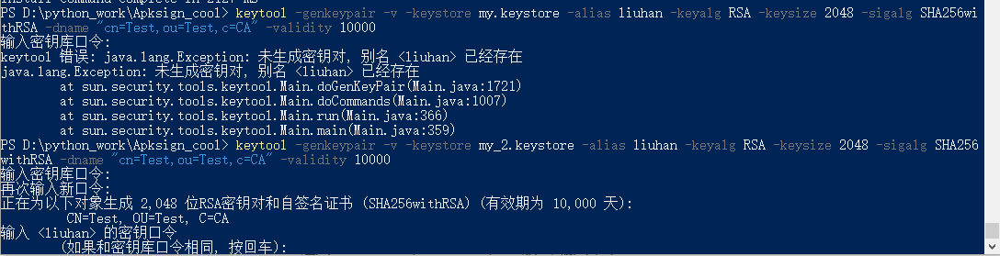
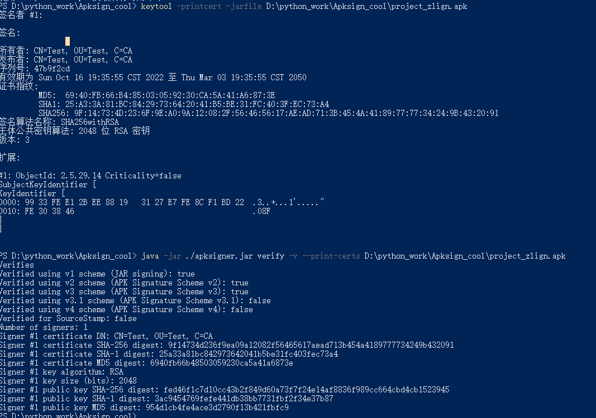
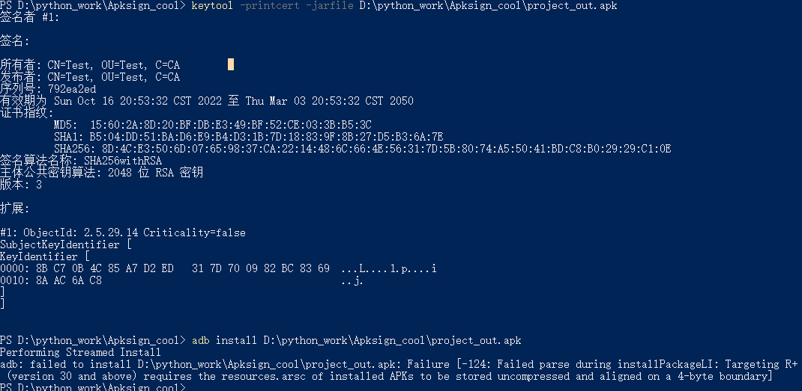

# APK 签名 v1 v2 步骤

## 1.生成 keystore

```
keytool -genkey -v -keystore my.keystore -alias liuhan -keyalg RSA -keysize 2048 -sigalg SHA256withRSA -dname "cn=Test,ou=Test,c=CA" -validity 10000
```


这里特别注意下:

​		-alias    liuhan    (liuhan) 是别名 后面我们需要使用这个别名来生成 v1 v2的签名


**提示要输入密钥口令 这里我们要记住自己的密钥口令 后面会用到**

```
参数：

-genkeypair 生成一条密钥对（由私钥和公钥组成）

-keystore 密钥库名字及存储位置（默认当前目录）

-alias 密钥对的别名（密钥库可以存在多个密钥对，用于区分不同密钥对）

-validity 密钥对的有效期（单位：天）

-keyalg 生成密钥对的算法（常用 RSA/DSA ，DSA 只用于签名，默认采用DSA 
```


生成结果图:




## 2.查看密钥库

```
keytool -list -v -keystore my.keystore
```


## 3.将未签名的apk进行四字节对齐操作

zipalign -v -f  4 D:\python_work\Apksign_cool\project.apk D:\python_work\Apksign_cool\zlign.apk

```
zipalign.exe -v -p 4 input.apk output.apk

zip对齐，因为APK包的本质是一个zip压缩文档，经过边界对齐方式优化能使包内未压缩的数据有序的排列，从而减少应用程序运行时的内存消耗 ，通过空间换时间的方式提高执行效率（zipalign后的apk包体积增大了100KB左右）。

zipalign命令选项不多：
-f : 输出文件覆盖源文件
-v : 详细的输出log
-p : outfile.zip should use the same page alignment for all shared object files within infile.zip
-c : 检查当前APK是否已经执行过Align优化。

另外上面的数字4是代表按照4字节（32位）边界对齐。

```


## 4.生成带v1 v2签名的apk

这里使用4步骤生成的zlign.apk 进行输入

```
java -jar ./apksigner.jar sign --ks my.keystore --ks-key-alias liuhan D:\python_work\Apksign_cool\out_zlign_v1_v2.apk   D:\python_work\Apksign_cool\zlign.apk
```

--ks my.keystore    (my.keystore) 是证书的名字和路径

--ks-key-alias liuhan   (liuhan ) 是my.keystore 的别名

D:\python_work\Apksign_cool\out_zlign_v1_v2.apk 这个参数是输出

D:\python_work\Apksign_cool\zlign.apk  这个参数是输入

```
java -jar apksigner.jar sign --ks xxx.jks --ks-key-alias xxx --ks-pass pass:xxxx --key-pass pass:xxxx --out output.apk moa.apk

java -jar apksigner.jar sign            //执行签名操作
--ks 你的jks路径                        //jks签名证书路径
--ks-key-alias 你的alias                  //生成jks时指定的alias
--ks-pass pass:你的密码                 //KeyStore密码
--key-pass pass:你的密码                //签署者的密码，即生成jks时指定alias对应的密码
--out output.apk                        //输出路径
input.apk                               //被签名的apk

```


## 5.验证签名apk的信息

使用命令如下:

```
keytool -printcert -jarfile D:\python_work\Apksign_cool\project_zlign.apk

java -jar ./apksigner.jar verify -v --print-certs D:\python_work\Apksign_cool\project_zlign.apk
```



## 6.使用 jarsigner.exe 生成只有v1的签名的apk

```
jarsigner.exe -verbose -keystore D:\python_work\Apksign_cool\my.keystore  -digestalg SHA1 -sigalg SHA1withRSA  -signedjar D:\python_work\Apksign_cool\project_out.apk D:\python_work\Apksign_cool\project_zlign.apk liuhan
```

## 7.错误提示

使用  jarsigner.exe 生成的v1 签名的apk  在android11 上安装时提示:

```
adb: failed to install D:\python_work\Apksign_cool\project_out.apk: Failure [-124: Failed parse during installPackageLI: Targeting R+ (version 30 and above) requires the resources.arsc of installed APKs to be stored uncompressed and aligned on a 4-byte boundary]
```



解决的话就是只能用  apksigner.jar 来签名


